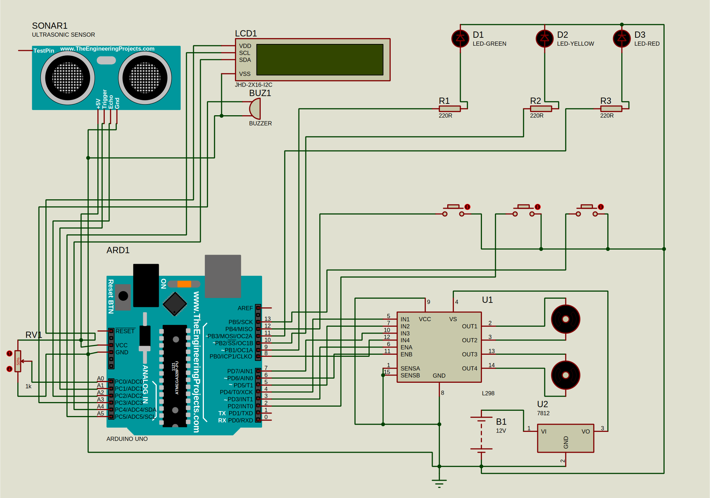

# Automatic Car Brake System

An Arduino-based obstacle-aware braking prototype for a small robotic vehicle. The system uses an ultrasonic sensor to detect nearby objects, regulates motor output through an L298 driver, and presents live status through a 16x2 I2C LCD, LEDs, and a buzzer.

## Overview

The controller continuously measures distance, then adjusts speed, visual indicators, and audible alerts according to the current range. This makes the project suitable as a simple demonstration of automated braking logic for Arduino-based mobility systems.

## Features

- Automatic forward motion when the path is clear
- Progressive warning levels based on obstacle distance
- Immediate motor stop behavior when an obstacle is too close
- LCD feedback for current speed and distance
- LED status indicators for safe, caution, and danger states
- Buzzer alerts that change with proximity
- Manual speed adjustment using buttons and a potentiometer

## Operating Logic

- Greater than 30 cm: move forward at the selected speed, green LED on, buzzer off
- Between 10 cm and 30 cm: reduce speed by half, yellow LED on, caution buzzer active
- 10 cm or less: stop the motors, red LED on, high-tone alarm active

## Hardware Used

- Arduino Uno
- L298 motor driver
- HC-SR04 ultrasonic sensor
- 16x2 LCD with I2C module
- Potentiometer
- Push buttons for stop, speed up, and speed down
- Three LEDs: green, yellow, and red
- Active buzzer
- DC motors and external power supply as required by the drive stage

## Pin Mapping

| Function | Arduino Pin |
| --- | --- |
| Motor enable A | 3 |
| Motor input 1 | 4 |
| Motor input 2 | 5 |
| Motor enable B | 6 |
| Motor input 3 | 7 |
| Motor input 4 | 8 |
| Green LED | 9 |
| Yellow LED | 10 |
| Red LED | 11 |
| Stop button | 12 |
| Speed up button | 2 |
| Speed down button | 13 |
| Buzzer | A3 |
| Ultrasonic trigger | A1 |
| Ultrasonic echo | A2 |
| Potentiometer | A0 |

## Software Requirements

- Arduino IDE
- LiquidCrystal_I2C library

## Setup

1. Open [FIRMWARE/Arduino Uno/main.ino](FIRMWARE/Arduino%20Uno/main.ino) in the Arduino IDE.
2. Install the `LiquidCrystal_I2C` library if it is not already available.
3. Select the correct board and COM port for the Arduino Uno.
4. Verify the wiring against the pin map above.
5. Upload the sketch to the board.

## Project Structure

- [FIRMWARE/Arduino Uno/main.ino](FIRMWARE/Arduino%20Uno/main.ino) - main firmware sketch
- [AutomaticCarBrakeSystem.SVG](AutomaticCarBrakeSystem.SVG) - Proteus circuit diagram export

## Notes

- The LCD address in the sketch is set to `0x27`.
- The braking thresholds are controlled in code and can be tuned for different sensor setups.
- The diagram file is embedded above so it displays directly in the README on GitHub.

## License

This project is licensed under the MIT License. See [LICENSE](LICENSE) for details.

## Suggested GitHub Topics

Add these topics in the GitHub repository settings for better discoverability: `arduino`, `robotics`, `automatic-braking`, `ultrasonic-sensor`, `l298`, `proteus`, `embedded-systems`, `iot`.